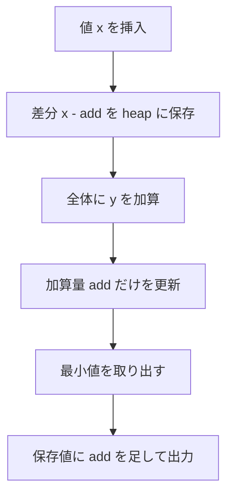

# 001

## 問題リンク

[ABC212 D - Querying Multiset](https://atcoder.jp/contests/abc212/tasks/abc212_d)

## キーワード

全要素へ同じ操作をするなら、基準値との差分で遅延評価する

## 何に着目するか

操作のたびに全要素を書き換える必要があるように見えるかを確認します。値を個別に更新する代わりに、全体に共通する変化を一つの変数で持てないか考えます。

## 解法方針

集合に入れる値を、全体に加えた量を差し引いた形で保存します。全要素加算は累積変数だけを更新し、最小値の取り出しでは保存値に累積分を戻します。



### 変換を式で確認する

その時点までに全要素へ加えた合計を `add` とします。実際の値が `x` の要素を挿入するとき、ヒープには `x - add` を保存します。以後に全体加算が何回あっても、実際の値は常に

```text
ヒープに保存した値 + 現在の add
```

で復元できます。全要素に `y` を足す操作は `add += y` だけでよく、ヒープ内の全要素を走査する必要がありません。

### 各クエリをどう処理するか

1. `1 x`（`x` を挿入）: `heappush(heap, x - add)`
2. `2 x`（全要素に `x` を加算）: `add += x`
3. `3`（最小値を出力して削除）: `heappop(heap) + add` を出力する

ヒープに入っている値どうしの大小関係は、全要素へ同じ `add` を足しても変わりません。したがって、保存値の最小を取り出せば実際の最小値も得られます。

## tips

### 実装

最小値の管理には `heapq` を使います。挿入時は `x - add`、取り出し時は `heappop(heap) + add` とします。

`add` は負の値にもなり得るので、初期値は `0` とし、問題の制約に合わせて十分大きい整数型を使います。Python の `int` なら桁あふれを心配する必要はありません。

### よくある誤り

- 全体加算のたびにヒープの全要素を書き換える: 1 回 `O(Q)` かかり、最悪 `O(Q^2)` になります。
- 挿入時に `x` をそのまま入れる: それ以前の要素と「基準」がそろわず、後で `add` を戻せません。
- 取り出し時に `add` を足し忘れる: ヒープの値は実際の値ではなく、ずれを除いた保存値です。

### 計算量

挿入・最小値取り出しは `O(log Q)`、全体加算は `O(1)` です。

## 典型・関連問題

- [ABC281 E - Least Elements](https://atcoder.jp/contests/abc281/tasks/abc281_e)
- [ABC217 E - Sorting Queries](https://atcoder.jp/contests/abc217/tasks/abc217_e)
- [ABC253 C - Max - Min Query](https://atcoder.jp/contests/abc253/tasks/abc253_c)
