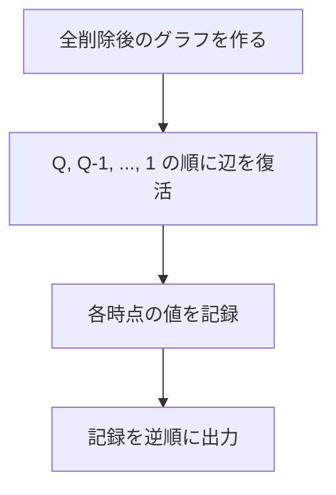

# 021

## 問題リンク

[ABC264 E - Blackout 2](https://atcoder.jp/contests/abc264/tasks/abc264_e)

## キーワード

削除だけの動的クエリは、逆順にして追加処理へ変換する

## 何に着目するか

Union-Find が得意なのは、辺を **追加して** 連結成分を併合することです。一方、順方向の「辺を削除する」操作では、成分が二つに分かれる可能性があり、通常の Union-Find だけでは追跡できません。

そこで、削除後の状態からクエリを逆順にたどります。逆順なら、各操作は「削除した辺を 1 本復活させる」操作になります。

## 解法方針

発電所 `N+1` 個は、都市へ電力を届けられるという意味では区別する必要がありません。そこで仮想頂点 `P` を 1 個用意し、すべての発電所を `P` とみなします。以後、`P` と同じ連結成分に入っている都市数が答えです。

まず、最終的に削除されている辺を除いたグラフを作ります。この状態は「全クエリを実行し終えた状態」です。ここから削除クエリを逆順に処理し、対応する辺を 1 本ずつ追加します。

### 併合前後だけを見ればよい

各連結成分に含まれる **都市数** を Union-Find と一緒に管理します。辺 `(u, v)` を追加するとき、すでに同じ成分なら何も変わりません。異なる成分なら、併合前に `P` を含む側と含まない側を調べます。

|併合する二成分|電気が届く都市数の増分|
|---|---:|
|どちらも `P` を含まない|`0`|
|どちらも `P` を含む|`0`|
|片方だけが `P` を含む|`P` を含まない成分の都市数|

つまり、発電所側の成分と新たにつながった都市側成分の大きさだけを答えに加えればよいです。併合後は二成分の都市数を足して保存します。

### 重複して削除される辺

同じ辺が複数回クエリに現れる場合、順方向で実際に効くのは最初の削除だけです。そのため、辺ごとの削除回数を数えます。初期状態では削除回数が 0 の辺だけを追加し、逆順で 1 回戻すたびに回数を減らして、0 になった時だけ辺を復活させます。

## tips

### 実装

`0 .. N-1` を都市、`N` を仮想発電所頂点にすると実装しやすくなります。各辺の端点が発電所なら端点を `N` に置き換えてから処理します。

Union-Find の根ごとに `city_count[root]` を持ちます。仮想頂点そのものは都市数に含めないため、初期値は都市で `1`、仮想頂点で `0` です。

### よくある誤り

- 順方向に削除を処理しようとする: Union-Find は分割を扱えません。
- 発電所をそれぞれ別頂点のままにする: 「いずれかの発電所につながる」という条件を毎回まとめ直す必要が出ます。
- クエリの答えを記録するタイミングを間違える: 逆順では、辺を復活する**前**の値が元のそのクエリの直後の値です。

### 計算量

各辺の追加と併合はならし `O(α(N))` です。全体で `O((M + Q) α(N))`、使用メモリは `O(N + M + Q)` です。

## 典型・関連問題

- [ABC120 D - Decayed Bridges](https://atcoder.jp/contests/abc120/tasks/abc120_d)
- [ABC229 E - Graph Destruction](https://atcoder.jp/contests/abc229/tasks/abc229_e)
- [ABC040 D - 道路の老朽化対策について](https://atcoder.jp/contests/abc040/tasks/abc040_d)
