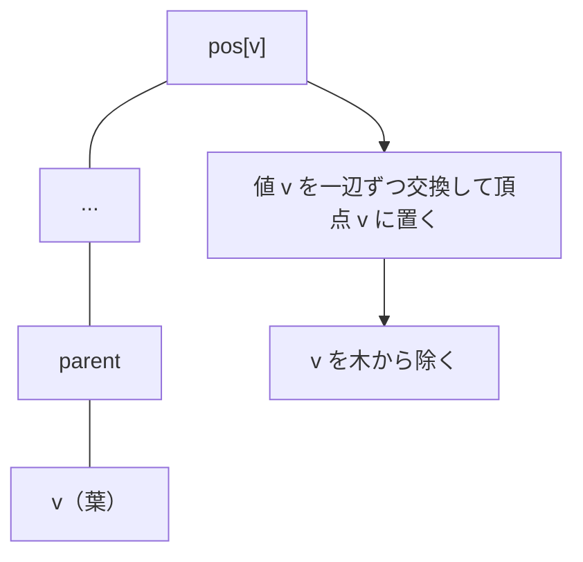

# 029

## 問題リンク

[ABC233 F - Swap and Sort](https://atcoder.jp/contests/abc233/tasks/abc233_f)

## キーワード

木上の交換で並べ替えるなら、葉を確定して不要な部分を縮める

## 何に着目するか

辺に沿う交換だけで置換を整列します。まず、値 `x` を頂点 `x` まで運べる必要があります。これは現在 `x` がある頂点と頂点 `x` が同じ連結成分にあることと同値です。

連結性を確認した後、各成分の全域木だけを使えば十分です。余分な辺を使う必要はなく、木の葉を一つずつ確定させると、確定済み頂点を再び壊さずに構成できます。

## 解法方針

最初に Union-Find で連結成分を求め、各頂点 `v` について `v` と `P[v]` が同じ成分かを確認します。満たさない頂点があれば `-1` です。

次に、各成分から辺番号付きの全域木を作ります。木の葉 `v` を一つ選び、現在値 `v` がある位置 `pos[v]` から、木上の一意な経路に沿って `v` を頂点 `v` へ運びます。経路上の辺を順に交換し、各交換の辺番号を記録します。

`v` を葉として確定した後は、その頂点を残りの木から取り除きます。以後の経路は削除済みの葉を通らないため、置いた `v` は二度と動きません。これを成分が空になるまで繰り返せば、全頂点が正しい値になります。

### 交換時に更新するもの

辺 `(a,b)` で値を交換したら、配列 `P` だけでなく「各値が今どこにあるか」の逆配列 `pos` も同時に更新します。

|交換前|交換後|
|---|---|
|`P[a]=x`, `P[b]=y`|`P[a]=y`, `P[b]=x`|
|`pos[x]=a`, `pos[y]=b`|`pos[x]=b`, `pos[y]=a`|

## tips

### 実装

全域木の構築時に、各採用辺の入力番号を隣接リストへ保存します。葉を管理するキューを使い、現在次数が 1 の頂点を順に処理します。

`pos[v]` から葉 `v` への経路は、残った木で BFS/DFS して親を復元すれば求められます。この問題の制約では、各葉ごとに探索しても十分です。経路を `pos[v] → ... → v` の順にして、その順に辺交換します。

### よくある誤り

- 値 `v` が頂点 `v` と別成分にあるケースを後から何とかしようとする。成分をまたぐ交換は不可能です。
- 葉を確定した後も以後の探索に使う。固定済みの値が動いてしまいます。
- `P` だけを交換して `pos` を更新しない。次に運ぶ値の位置が壊れます。

### 計算量

全域木構築は `O(N+M)` です。各葉で残りの木を探索する実装なら合計 `O(N^2+M)` 程度で、この問題の制約内です。メモリは `O(N+M)` です。

## 典型・関連問題

- [ABC251 F - Two Spanning Trees](https://atcoder.jp/contests/abc251/tasks/abc251_f)
- [ABC314 G - Amulets](https://atcoder.jp/contests/abc314/tasks/abc314_g)
- [ABC371 C - Make Isomorphic](https://atcoder.jp/contests/abc371/tasks/abc371_c)
