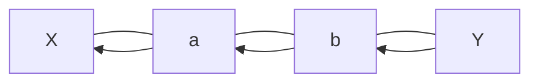

# 033

## 問題リンク

[ABC270 C - Simple path](https://atcoder.jp/contests/abc270/tasks/abc270_c)

## キーワード

木の二頂点間の経路は、探索時の親をたどって復元する

## 何に着目するか

木には閉路がないため、二頂点間の単純パスはただ一つです。始点から探索したときに「その頂点へ初めて到達した一つ前の頂点」を記録すれば、終点から逆にたどってそのパスを復元できます。

DFS と BFS のどちらを使っても構いません。最短距離は問われないので、探索順は答えに影響しません。

## 解法方針

始点 `X` から DFS/BFS をします。未訪問の頂点 `to` を見つけたら、`parent[to]=v` としてから探索へ進めます。木では、これが `X` から `to` への一意な経路の直前の頂点です。

終点 `Y` に着いたら、親をたどります。

`Y → b → a → X` と親をたどって集め、反転すると `X` から `Y` の経路になります。

終点に達した後も全探索して構いませんが、親が決まった時点で探索を打ち切ってもよいです。

## tips

### 実装

`parent` を全て `-1` で初期化し、始点だけ `parent[X]=X` のような番兵にします。`parent[to] != -1` を未訪問判定に使えるため、`visited` 配列は不要です。

復元では `v=Y` から `v==X` になるまで `path.append(v)` と `v=parent[v]` を繰り返し、最後に `X` を加えて `reverse()` します。

### よくある誤り

- 木なのに隣接頂点すべてへ無条件に再帰する。親へ戻って無限再帰になります。
- 終点から始点へたどった列を反転せずに出力する。
- `parent[X]` を `-1` のままにし、始点を未訪問扱いする。

### 計算量

各頂点と辺を高々一度ずつ見るため、時間・メモリともに `O(N)` です。

## 典型・関連問題

- [ABC213 D - Takahashi Tour](https://atcoder.jp/contests/abc213/tasks/abc213_d)
- [ABC054 C - One-stroke Path](https://atcoder.jp/contests/abc054/tasks/abc054_c)
- [ABC294 G - Distance Queries on a Tree](https://atcoder.jp/contests/abc294/tasks/abc294_g)
