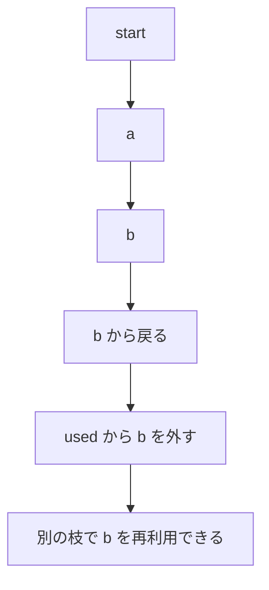

# 034

## 問題リンク

[ABC284 E - Count Simple Paths](https://atcoder.jp/contests/abc284/tasks/abc284_e)

## キーワード

単純パスを数える DFS は、現在の経路だけを訪問済みにして戻す

## 何に着目するか

数えるのは「頂点を重複して通らない経路」です。同じ頂点でも、別の経路から到達したなら別の候補として再び使う必要があります。そのため、探索全体での訪問済みではなく、現在たどっている経路だけを禁止します。

また、答えが `10^6` 以上ならそれ以上の正確な個数は不要です。探索回数自体を上限で打ち切れます。

## 解法方針

現在地 `v` を DFS で訪れたら答えを 1 増やします。`v` の未使用隣接頂点 `to` ごとに、`to` を経路へ加えて再帰し、戻るときに経路から外します。

`answer >= 10^6` になったら、以後の DFS 呼び出しを即座に return します。これにより、グラフの経路数が指数的に多くても、実際の再帰回数は高々ほぼ `10^6` 回です。

## tips

### 実装

`used[v]=True` は DFS の入口、`used[v]=False` は DFS の出口に置きます。入口で `answer += 1` を行えば、始点だけの長さ 0 の経路も 1 通りとして数えられます。

再帰の前後で `used[to]` を設定・解除する書き方でも構いませんが、どちらかに統一します。Python では再帰上限を `N` より大きくします。

### よくある誤り

- 一度訪れた頂点を永続的に禁止する。別の経路を数え落とします。
- 打ち切りを DFS の最上位でしか判定しない。深い再帰へ不要に入り続けます。
- `used` を戻し忘れる。以後の枝が探索できなくなります。

### 計算量

出力上限までの DFS 呼び出し数は `O(10^6)` です。各呼び出しで隣接リストを走査するため、厳密には次数の総和に依存しますが、問題の制約内で十分です。メモリはグラフと再帰スタックで `O(N+M)` です。

## 典型・関連問題

- [ABC054 C - One-stroke Path](https://atcoder.jp/contests/abc054/tasks/abc054_c)
- [ABC002 D - 派閥](https://atcoder.jp/contests/abc002/tasks/abc002_4)
- [ABC199 D - RGB Coloring](https://atcoder.jp/contests/abc199/tasks/abc199_d)
