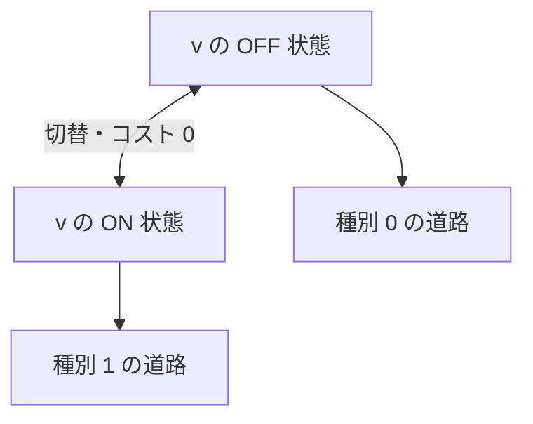

# 054

## 問題リンク

[ABC277 E - Crystal Switches](https://atcoder.jp/contests/abc277/tasks/abc277_e)

## キーワード

条件で使える辺が変わるなら、状態を頂点と組にして最短路を解く

## 何に着目するか

同じ頂点にいても、スイッチが ON / OFF のどちらかで通れる辺が変わります。頂点番号だけを状態にすると、到達後に何ができるかを区別できません。

`(頂点, スイッチ状態)` を一つの頂点とみなすと、問題は辺重みが 0 または 1 の最短路になります。

## 解法方針

各元の頂点 `v` を `v_0`（OFF）と `v_1`（ON）へ複製します。

|元の操作|拡張グラフの辺|コスト|
|---|---|---:|
|種別 0 の道路を通る|`u_0 ↔ v_0`|`1`|
|種別 1 の道路を通る|`u_1 ↔ v_1`|`1`|
|スイッチのある頂点で切替|`v_0 ↔ v_1`|`0`|

初期状態は `(1, ON)` です（問題文の初期スイッチ状態に合わせる）。ゴール頂点について OFF / ON の二状態の距離の小さいほうを取ります。

辺重みが 0 と 1 だけなので、Dijkstra ではなく deque を使う 0-1 BFS を行えます。重み 0 の遷移は deque の前、重み 1 は後ろへ追加します。

## tips

### 実装

状態を `id = v + state*N` のように整数へ潰すと、距離配列を長さ `2N` にできます。道路は種別に応じて同じ state 層へ、スイッチ頂点では反対層へ辺を張ります。

取り出した距離が現在の `dist[id]` と違う場合は古い候補なので飛ばします。

### よくある誤り

- スイッチを全体で一度しか切り替えられないと考える。切替はスイッチのある頂点で何度でもできます。
- 道路の種類と状態を逆に結ぶ。小さな例で「初期状態でどちらが通れるか」を確認します。
- 0 コスト辺を deque の後ろに入れる。0-1 BFS の距離順が崩れます。

### 計算量

状態数は `2N`、辺数は道路由来 `2M` と切替由来 `O(N)` です。0-1 BFS により時間 `O(N+M)`、メモリ `O(N+M)` です。

## 典型・関連問題

- [ABC176 D - Wizard in Maze](https://atcoder.jp/contests/abc176/tasks/abc176_d)
- [ABC246 E - Bishop 2](https://atcoder.jp/contests/abc246/tasks/abc246_e)
- [ABC348 D - Medicines on Grid](https://atcoder.jp/contests/abc348/tasks/abc348_d)
