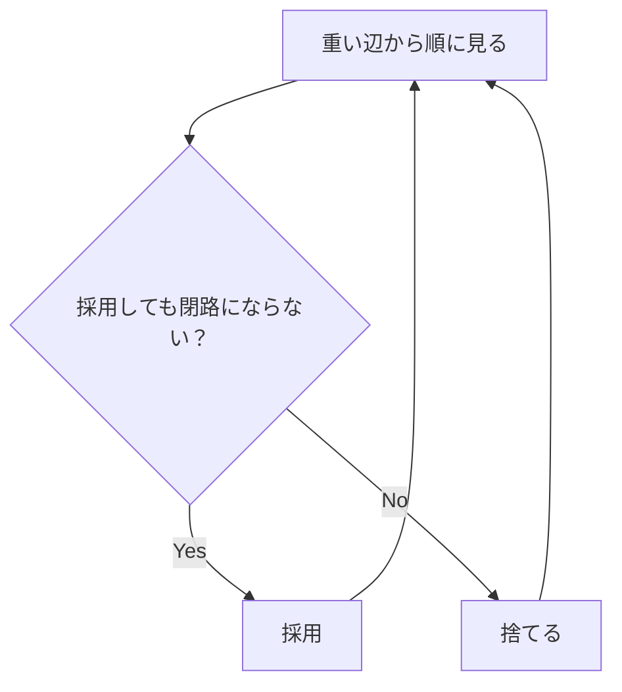

# 058

## 問題リンク

[ABC282 E - Choose Two and Eat One](https://atcoder.jp/contests/abc282/tasks/abc282_e)

## キーワード

連結にする得点最大化は、重い辺から選ぶ最大全域木を疑う

## 何に着目するか

選んだ操作のグラフが連結であれば全ての要素を一つにできます。余分な辺を選んでも得点が増えるだけに見えますが、操作回数はちょうど `N-1` 回なので、選ぶ辺は連結かつ閉路なし、つまり全域木です。

得点を最大化する全域木は、Kruskal 法を辺重みの**降順**で行う最大全域木です。

## 解法方針

頂点 `i,j` の辺重みを

```text
w(i,j) = (A[i]^A[j] + A[j]^A[i]) mod M
```

として全ての `i<j` について作ります。辺を重み降順にソートし、Union-Find で別成分を結ぶ辺だけを採用します。

|辺を見たとき|処理|
|---|---|
|端点が別成分|採用し、得点へ加え、併合|
|同じ成分|閉路になるため不採用|



Kruskal の交換法則により、この手順で得られる全域木の重み和は最大です。

## tips

### 実装

べき乗は繰り返し乗算せず、Python では `pow(a,b,M)`、C++ では高速累乗で `mod M` を取りながら計算します。完全グラフなので辺数は `N(N-1)/2` 本です。

Union-Find で採用辺が `N-1` 本になったら残り辺を見る必要はありません。

### よくある誤り

- 最小全域木のように昇順で処理する。ここでは得点を最大化するので降順です。
- 同じ成分の辺も得点のために採用する。操作回数が `N-1` であり、閉路を作る余裕はありません。
- `A[i]^A[j]` を通常の累乗として計算する。指数が大きいので剰余付き高速累乗が必要です。

### 計算量

辺生成は `O(N^2 log M)` 程度、辺ソートは `O(N^2 log N)`、Union-Find はならし線形です。メモリは辺列 `O(N^2)` です。

## 典型・関連問題

- [ABC218 E - Destruction](https://atcoder.jp/contests/abc218/tasks/abc218_e)
- [ABC270 F - Transportation](https://atcoder.jp/contests/abc270/tasks/abc270_f)
- [ABC065 D - Built?](https://atcoder.jp/contests/abc065/tasks/arc076_b)
