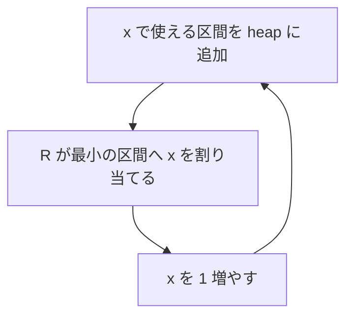

# 063

## 問題リンク

[ABC214 E - Packing Under Range Regulations](https://atcoder.jp/contests/abc214/tasks/abc214_e)

## キーワード

区間への割当は、使える候補のうち締切が最も早いものを優先する

## 何に着目するか

各区間 `[L,R]` に異なる整数を一つずつ割り当てます。現在の整数 `x` を割り当てられる候補の中で、右端 `R` が早い区間を後回しにすると、その区間が期限切れになる恐れがあります。

よって、使える区間を集めて「締切最早」を常に選ぶ貪欲法が安全です。

## 解法方針

区間を左端 `L` の昇順にソートします。現在の割り当て整数を `x` とし、`L≤x` の未処理区間を右端 `R` の最小ヒープへ入れます。

|状況|処理|
|---|---|
|ヒープが空|次の区間の `L` へ `x` を飛ばす|
|ヒープ最小の `R < x`|締切切れなので `No`|
|それ以外|最小 `R` を pop して `x` を割当|

最小右端の区間を今の `x` に割り当てる代わりに、別の使える区間へ割り当てていた解があっても、その二つの割当を交換できます。別区間の右端は最小右端以上なので、後の整数を渡しても壊れません。これが貪欲選択の根拠です。

## tips

### 実装

次の区間がまだヒープへ入らず、ヒープも空なら `x=intervals[i].L` とします。整数を 1 ずつ大きな空白まで進める必要はありません。

全区間を処理した後も、ヒープが空になるまで同じ処理を続けます。

### よくある誤り

- 使える区間の中で左端が小さいものを優先する。重要なのは締切 `R` です。
- ヒープが空のとき `x++` を繰り返す。次の左端へジャンプします。
- `R==x` を期限切れとする。`x` 自身は区間に含まれるので使えます。

### 計算量

各区間を一回ヒープへ入れ、一回取り出します。ソートを含めて時間 `O(N log N)`、メモリ `O(N)` です。

## 典型・関連問題

- [ABC325 D - Printing Machine](https://atcoder.jp/contests/abc325/tasks/abc325_d)
- [ABC342 E - Last Train](https://atcoder.jp/contests/abc342/tasks/abc342_e)
- [ABC330 E - Mex and Update](https://atcoder.jp/contests/abc330/tasks/abc330_e)
