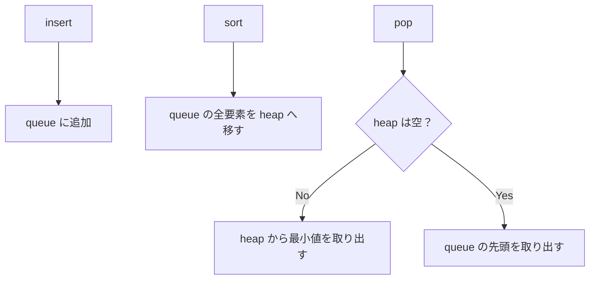

# 064

## 問題リンク

[ABC217 E - Sorting Queries](https://atcoder.jp/contests/abc217/tasks/abc217_e)

## キーワード

途中で並び替えが入る列は、未整列部分と整列済み部分を分けて持つ

## 何に着目するか

要素は挿入直後には「挿入順」で取り出されますが、ソート要求の後は「値の小さい順」で取り出されます。毎回全要素をソートする必要はありません。ソートされるまでの新要素を FIFO キューに置き、ソート要求が来た時点で既存分だけをヒープへ移します。

## 解法方針

二つの容器を持ちます。

|容器|入っている要素|取り出し順|
|---|---|---|
|`queue`|直近のソート要求より後に挿入された要素|FIFO|
|`heap`|ソート要求を一度以上通過した要素|最小値順|

クエリごとの操作は次です。

1. 挿入 `x`: `queue` の末尾へ追加する。
2. ソート要求: `queue` の全要素を `heap` へ移す。
3. 出力: `heap` が非空なら最小を、空なら `queue` の先頭を出す。

過去のソート要求を通った要素は、新しく挿入された要素より先に取り出すべきです。そのため、ヒープが空でない限りキューを先に出してはいけません。

## tips

### 実装

Python では `collections.deque` と `heapq` を使います。ソート要求で `while queue: heappush(heap, queue.popleft())` とします。

一つの要素は queue へ入り、高々一度 heap へ移り、どちらかから一度取り出されます。

### よくある誤り

- 常にヒープへ挿入する。ソート前の FIFO 順を壊します。
- 出力時に queue を優先する。すでにソート対象の要素が残っていればそちらが先です。
- ソート要求ごとに heap 全体をソートし直す。heap への移送だけでよいです。

### 計算量

各要素の heap 操作は高々一回ずつなので、全体で `O(Q log Q)`、メモリは `O(Q)` です。

## 典型・関連問題

- [ABC212 D - Querying Multiset](001.md)
- [ABC281 E - Least Elements](057.md)
- [ABC253 C - Max - Min Query](https://atcoder.jp/contests/abc253/tasks/abc253_c)
