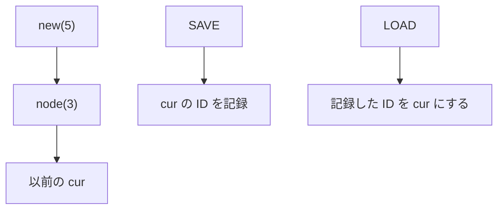

# 081

## 問題リンク

[ABC273 E - Notebook](https://atcoder.jp/contests/abc273/tasks/abc273_e)

## キーワード

過去の状態へ戻るスタックは、親ポインタを共有する永続化で持つ

## 何に着目するか

`SAVE` 後に要素の追加・削除をしても、`LOAD` では保存時点の状態へ戻ります。配列をコピーして保存すると重くなりますが、スタックの追加は「一つ前の先頭を親にした新しい先頭」を作るだけです。

状態を破壊せず、先頭ノード ID だけを保存します。

## 解法方針

各ノードに値 `value[node]` と一つ前のノード `parent[node]` を持たせます。現在のスタックは先頭ノード `cur` で表します。

|操作|`cur` の更新|
|---|---|
|`ADD x`|`new` を作り、`value[new]=x`, `parent[new]=cur`, `cur=new`|
|`DELETE`|空でなければ `cur=parent[cur]`|
|`SAVE y`|`saved[y]=cur`|
|`LOAD y`|`cur=saved[y]`（未保存なら空）|

過去のノードは一切書き換えないため、複数の保存状態が同じ途中ノードを共有しても安全です。各操作後、`cur=0`（空）なら `-1`、それ以外なら `value[cur]` を出力します。

## tips

### 実装

ノード 0 を空スタックの番兵にし、`parent[0]=0` とします。`ADD` のたびにノード番号を一つ増やすだけでよく、配列を事前にクエリ数ぶん確保できます。

`saved` はキー `y` からノード ID への辞書です。未保存の `LOAD` は `0` にします。

### よくある誤り

- `SAVE` でスタック内容をコピーする。保存対象は先頭 ID 一つです。
- `DELETE` でノードを削除する。後で `LOAD` から参照されるので残します。
- 未保存の `LOAD` を無視する。空ノートへ戻ります。

### 計算量

各クエリは配列・辞書への定数回アクセスなので、期待 `O(1)`、メモリは追加回数に比例して `O(Q)` です。

## 典型・関連問題

- [ABC315 E - Prerequisites](https://atcoder.jp/contests/abc315/tasks/abc315_e)
- [ABC294 D - Bank](https://atcoder.jp/contests/abc294/tasks/abc294_d)
- [ABC217 E - Sorting Queries](064.md)
