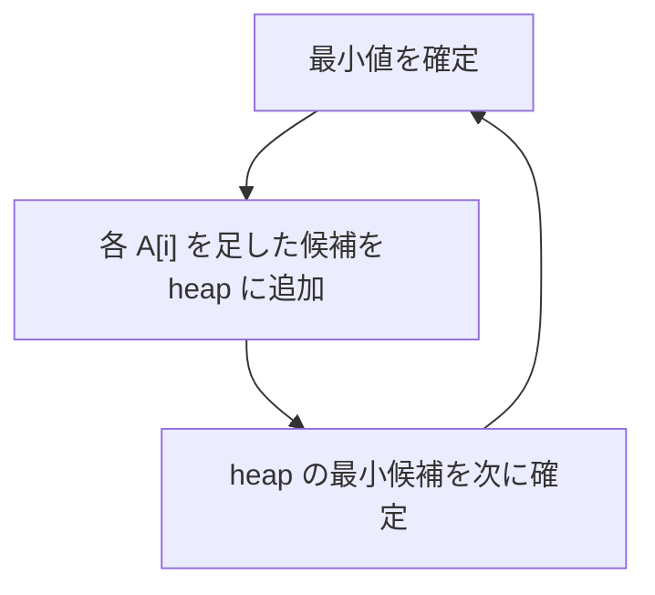

# 089

## 問題リンク

[ABC297 E - Kth Takoyaki Set](https://atcoder.jp/contests/abc297/tasks/abc297_e)

## キーワード

小さい順に生成する数は、確定値から次候補をヒープへ広げる

## 何に着目するか

作れる値は、0 から始めて基本値 `A[i]` を何回でも足したものです。全ての組合せを作ってソートできませんが、確定した小さい値 `x` からは `x+A[i]` という次の候補だけを生成すれば、最小ヒープで昇順列挙できます。

## 解法方針

最小ヒープを `{0}`、訪問済み集合を `{0}` で始めます。最小値 `x` を取り出すたび、各 `A[i]` について `x+A[i]` を候補にします。まだ集合に無いときだけヒープへ入れます。

値は加算でしか増えないため、ヒープから取り出された値は未確定の値の中で最小です。0 を 0 番目として、`K` 回取り出した後の値が答えです。

|処理|意味|
|---|---|
|heap pop|次に小さい作れる値を確定|
|`x+A[i]` を push|その値から一回追加した候補を生成|
|visited で判定|複数の作り方による重複を防ぐ|

## tips

### 実装

重複は heap から取り出すときではなく、**入れるとき**に `visited` へ登録します。同じ値が大量に heap へ入るのを防げます。

`K=0` なら初期値 0 が答えです。ループ回数と「pop 後に答えを更新する」位置を確認します。

### よくある誤り

- `A` の個数を一回ずつしか使えないとする。各基本値は何回でも使えます。
- 同じ値を heap に重複挿入する。組合せ順が違っても値は同じです。
- 0 を一回目ではなく一回足した値から数える。0 も作れる値です。

### 計算量

確定値を `K+1` 個生成し、一つにつき `N` 候補を考えます。時間 `O(KN log(KN))`、メモリ `O(KN)` 程度です。

## 典型・関連問題

- [ABC235 D - Multiply and Rotate](https://atcoder.jp/contests/abc235/tasks/abc235_d)
- [ABC217 E - Sorting Queries](https://atcoder.jp/contests/abc217/tasks/abc217_e)
- [ABC212 D - Querying Multiset](https://atcoder.jp/contests/abc212/tasks/abc212_d)
