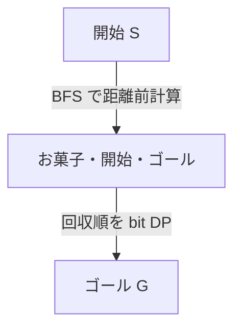

# 091

## 問題リンク

[ABC301 E - Pac-Takahashi](https://atcoder.jp/contests/abc301/tasks/abc301_e)

## キーワード

少数の重要地点を巡る問題は、地点間距離を前計算して bit DP する

## 何に着目するか

グリッド上の移動経路と、お菓子を取る順序を同時に考えると複雑です。お菓子候補は少数なので、重要地点間の最短距離を BFS で先に求めれば、残るのは完全グラフ上での巡回順序だけです。

## 解法方針

始点 `S`、お菓子 `C[0..K-1]`、終点 `G` の各地点から BFS を行い、地点間距離を前計算します。到達不能なら距離を `INF` とします。

`dp[mask][i]` を「`mask` のお菓子を回収済みで、最後に `i` を取ったときの最短時間」とします。

```text
dp[1<<i][i] = dist(S, C[i])
dp[mask | 1<<j][j]
  = min(dp[mask][i] + dist(C[i], C[j]))
```

各状態について `dp[mask][i] + dist(C[i],G) ≤ T` なら、`popcount(mask)` 個を回収してゴールできます。最大個数を更新します。



お菓子を一つも取らず `S→G` へ行ける場合は答え 0 なので、最初に `dist(S,G)≤T` を確認します。

## tips

### 実装

重要地点は最大でもお菓子数 + 2 個です。各地点からの BFS でグリッド全体を一度走査します。壁 `#` は通れません。

距離が `INF` の遷移は飛ばします。bit DP の初期値は十分大きい値にします。

### よくある誤り

- BFS を始点から一回だけ行う。お菓子間の最短距離も必要です。
- お菓子を全て取らなければならないとする。時間内に取れる最大数を求めます。
- お菓子回収後にゴールへ行けるか確認しない。

### 計算量

お菓子数を `K` とすると、BFS 前計算が `O((K+2)HW)`、bit DP が `O(2^K K^2)`、メモリが `O(2^K K)` です。

## 典型・関連問題

- [ABC274 E - Booster](https://atcoder.jp/contests/abc274/tasks/abc274_e)
- [ABC190 E - Magical Ornament](https://atcoder.jp/contests/abc190/tasks/abc190_e)
- [ABC338 F - Negative Traveling Salesman](https://atcoder.jp/contests/abc338/tasks/abc338_f)
