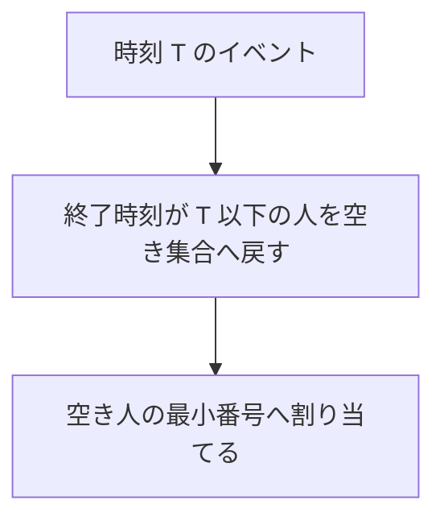

# 102

## 問題リンク

[ABC320 E - Somen Nagashi](https://atcoder.jp/contests/abc320/tasks/abc320_e)

## キーワード

割当と解放が混在する処理は、空き資源と終了時刻を別のヒープで管理する

## 何に着目するか

流しそうめんが来た時刻に空いている人のうち、番号最小の人が取ります。人は担当後、指定時刻に再び空きます。必要な順序は「空き人の最小番号」と「作業中の最も早い終了時刻」の二つなので、ヒープを分けます。

## 解法方針

|ヒープ|キー|内容|
|---|---|---|
|`available`|人の番号|現在空いている人|
|`busy`|終了時刻|`(終了時刻, 人)`|

各イベント時刻 `T` の直前に、`busy` の終了時刻が `T` 以下の人を全て pop し、`available` へ戻します。その後 `available` が非空なら最小番号の人へ報酬 `W` を足し、`(T+S, 人)` を `busy` へ入れます。

同時刻に終了・到着が起きる場合、終了した人は新しいそうめんを取れるので、必ず終了処理を先に行います。

## tips

### 実装

初期状態では全員を `available=[0,1,...,N-1]` へ入れます。各そうめんは一度だけ処理し、担当者の合計を配列へ加算します。

`busy` は終了時刻が同じでも人番号を第二キーにするタプルで問題ありません。

### よくある誤り

- `end < T` の人だけ戻す。`end == T` もすでに空いています。
- 空き人がいないときに busy から最も早い人を待たせて取らせる。そうめんは流れてしまいます。
- 一つしかヒープを使わず、番号順と時刻順を混ぜる。

### 計算量

各人の担当開始・終了はヒープへ一回ずつ入出するので、時間 `O(M log N)`、メモリ `O(N+M)` です。

## 典型・関連問題

- [ABC214 E - Packing Under Range Regulations](https://atcoder.jp/contests/abc214/tasks/abc214_e)
- [ABC325 D - Printing Machine](https://atcoder.jp/contests/abc325/tasks/abc325_d)
- [ABC294 D - Bank](https://atcoder.jp/contests/abc294/tasks/abc294_d)
