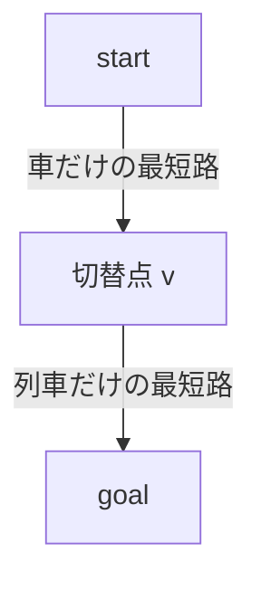

# 107

## 問題リンク

[ABC325 E - Our clients, please wait a moment](https://atcoder.jp/contests/abc325/tasks/abc325_e)

## キーワード

車から列車へ切り替える一点を二本の最短路の和で全探索する

## 何に着目するか

移動は「車だけ」または「車を使った後に列車へ切り替える」形です。一度列車へ切り替えた後に車へ戻っても、車部分を先にまとめて走れば同じかよりよい経路にできます。

切替点 `v` を固定すれば、始点から `v` までは車だけ、`v` から終点までは列車だけの独立な最短路です。

## 解法方針

完全グラフの辺 `(i,j)` に対し、車コストを `A*D[i][j]`、列車コストを `B*D[i][j]+C` とします。

1. 始点から車コストだけで Dijkstra を行い `car[v]` を求める。
2. 終点から列車コストだけで Dijkstra を行い `train[v]`（`v` から終点まで）を求める。
3. 全 `v` について `car[v]+train[v]` の最小を取る。

列車コストは行き先に依存せず対称なので、終点を始点として同じ重みで Dijkstra を行えば `v→goal` の距離になります。

## tips

### 実装

完全グラフなので隣接リストを明示的に作らず、Dijkstra で確定した頂点 `v` から全 `to` を走査して緩和できます。`N` が小さいため、優先度付きキューなしの `O(N^2)` Dijkstra でも十分です。

コストは 64 bit 整数で持ちます。

### よくある誤り

- 車と列車を何度も交互に使う状態 DP をする。最適解は一回の切替で表せます。
- 列車の `+C` を全経路に一度だけ足す。列車に乗る辺ごとのコストです。
- `train[v]` を始点から計算した値と取り違える。終点までの残りコストが必要です。

### 計算量

二回の完全グラフ Dijkstra と切替点走査で `O(N^2 log N)` 程度、メモリ `O(N^2)`（距離行列を含む）です。

## 典型・関連問題

- [ABC252 E - Road Reduction](013.md)
- [ABC192 E - Train](https://atcoder.jp/contests/abc192/tasks/abc192_e)
- [ABC340 D - Super Takahashi Bros.](https://atcoder.jp/contests/abc340/tasks/abc340_d)
