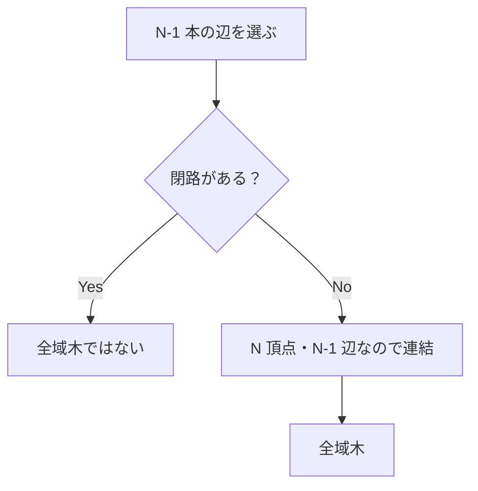

# 110

## 問題リンク

[ABC328 E - Modulo MST](https://atcoder.jp/contests/abc328/tasks/abc328_e)

## キーワード

小さい辺数では N-1 本の組合せを全列挙して全域木だけを判定する

## 何に着目するか

通常の MST なら Kruskal 法ですが、目的が「重み和を `K` で割った余りの最小」であり、辺の局所的な交換では最適性を保てません。一方でこの問題は辺数が小さく、全域木候補を全探索できます。

## 解法方針

全域木はちょうど `N-1` 本の辺からなります。全辺から `N-1` 本を選ぶ組合せを列挙し、Union-Find で閉路があるかを調べます。

閉路なしなら選んだ辺の重み和 `sum` を計算し、`sum mod K` で答えを更新します。

`N` 頂点で `N-1` 本の辺を持つグラフは、閉路がなければ必ず連結です。そのため、成分数を別に確認しなくても全域木と判定できます。

## tips

### 実装

組合せ生成で辺番号を選び、各候補ごとに新しい Union-Find を作ります。辺を追加する時点で同じ根なら閉路なので打ち切れます。

重み和は `K` で随時剰余を取っても、最後に取っても構いません。

### よくある誤り

- Kruskal の昇順／降順だけで余り最小を狙う。余りは単調な目的関数ではありません。
- `N-1` 本選んだだけで無条件に全域木とする。閉路があれば孤立した頂点が残ります。
- Union-Find を候補間で初期化し忘れる。

### 計算量

辺数を `M` とすると、`C(M,N-1)` 候補ごとに高々 `N-1` 辺を調べます。時間 `O(C(M,N-1)N)`、メモリ `O(N+M)` です。

## 典型・関連問題

- [ABC282 E - Choose Two and Eat One](https://atcoder.jp/contests/abc282/tasks/abc282_e)
- [ABC218 E - Destruction](https://atcoder.jp/contests/abc218/tasks/abc218_e)
- [ABC065 D - Built?](https://atcoder.jp/contests/abc065/tasks/arc076_b)
