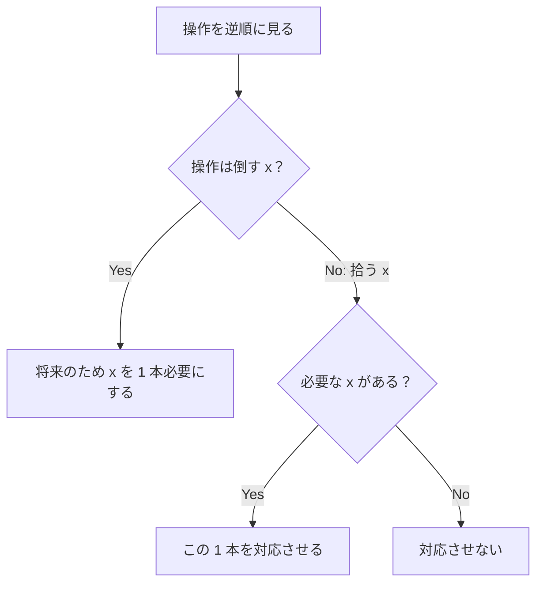

# 115

## 問題リンク

[ABC333 E - Takahashi Quest](https://atcoder.jp/contests/abc333/tasks/abc333_e)

## キーワード

後ろから必要な種類だけを選び、順方向で最大所持数を数える

## 何に着目するか

モンスターを倒す操作には同じ種類のポーションが必要です。後ろから見ると「この先で倒すために、その種類のポーションが何本必要か」が分かるため、取得操作を採用すべきか即座に決められます。

## 解法方針

種類 `x` ごとに、逆順で必要なポーション数 `need[x]` を持ちます。

|逆順で見る操作|処理|
|---|---|
|モンスター `x` を倒す|`need[x] += 1`|
|ポーション `x` を拾う|`need[x]>0` なら採用して `need[x] -= 1`、不要なら不採用|

最後にどこかの `need[x]` が残るなら、必要なポーションが過去に無く不可能です。

採用した取得操作だけを順方向で再生し、所持ポーション総数を増減させます。その途中の最大値が求める答えです。

## tips

### 実装

取得操作ごとの採用フラグ `ans[i]` を保存します。逆走査では種類ごとの配列／辞書を更新し、順走査では採用フラグが 1 のときだけ所持数を増やします。

モンスター操作では順走査で必ず対応するポーションを一つ消費します。

### よくある誤り

- 順方向で貪欲に全ポーションを拾う。最大所持数を不要に増やします。
- 逆順で拾ったとき、`need[x]==0` でも採用する。将来の敵に使われません。
- 可否だけ判定して、順方向で最大所持数を数えない。

### 計算量

逆走査と順走査を各一回行うので、時間・メモリともに `O(N)` です。

## 典型・関連問題

- [ABC217 E - Sorting Queries](https://atcoder.jp/contests/abc217/tasks/abc217_e)
- [ABC294 D - Bank](https://atcoder.jp/contests/abc294/tasks/abc294_d)
- [ABC325 D - Printing Machine](https://atcoder.jp/contests/abc325/tasks/abc325_d)
