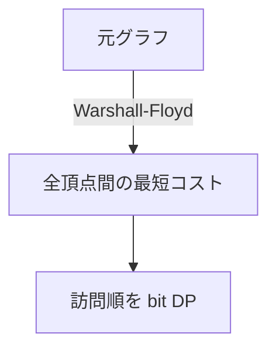

# 120

## 問題リンク

[ABC338 F - Negative Traveling Salesman](https://atcoder.jp/contests/abc338/tasks/abc338_f)

## キーワード

全点対最短距離へ閉包してから、始点自由の巡回 bit DP をする

## 何に着目するか

負辺があり、直接辺だけを使う巡回順序では最適経路を表せないことがあります。まず Warshall-Floyd で任意二頂点間の最短移動コストへ置き換えれば、「全頂点を少なくとも一度訪れる順序」だけを考える bit DP になります。

## 解法方針

`dist[i][j]` を全点対最短距離にします。`dp[mask][v]` を「`mask` の頂点を訪問済みで、最後が `v` の最小コスト」とします。

開始頂点は自由なので、全 `v` について

```text
dp[1<<v][v] = 0
```

で初期化します。未訪問 `to` への遷移は

```text
dp[mask | 1<<to][to]
  = min(dp[...], dp[mask][v] + dist[v][to])
```



全頂点を含む `mask=(1<<N)-1` の全終点の最小が答えです。到達不能なら `No` を出力します。

## tips

### 実装

Warshall-Floyd の初期距離は `INF`、対角は 0、重複辺は最小コストを取ります。負辺があるため Dijkstra は使えません。

DP 遷移前に `dist[v][to]` や `dp[mask][v]` が `INF` でないか確認します。

### よくある誤り

- 開始頂点を 0 に固定する。問題では任意の始点を選べます。
- 最短路閉包をせず直接辺だけで DP する。途中の未訪問／既訪問頂点を経由する最短移動を見落とします。
- 負辺があるから最短距離を計算しない。負閉路はないため Warshall-Floyd で扱えます。

### 計算量

Warshall-Floyd が `O(N^3)`、bit DP が `O(2^N N^2)`、メモリ `O(2^N N+N^2)` です。

## 典型・関連問題

- [ABC301 E - Pac-Takahashi](091.md)
- [ABC274 E - Booster](082.md)
- [ABC190 E - Magical Ornament](https://atcoder.jp/contests/abc190/tasks/abc190_e)
